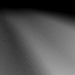

# Image regression

A toy application that learns a mapping from (x, y) coordinates to color.

## Usage

### Train on a single greyscale image
`python train.py -i keyboard.png --num-epochs 1000`

### Train on a single color image (RGBA)
`python train.py -i landscape.png --num-epochs 1000`

### Train on multiple images
`python train_many.py -i boxy_stripes2.png boxy_stripes2_30.png boxy_stripes2_60.png boxy_stripes2_90.png`

Then interpolate between the images:

`python interpolate_between_many.py --num-images 4 --model output/that_model_filename.h5`

## Examples

| Name | Original | Learned image |
| ---- | -------- | ------------- |
| Keyboard |  |  |
| 8x8 Checkerboard |  |  |

The following animation visualizes the output of a neural network that was trained on 12 different images (different rotations of boxy stripes). The input vectors are constructed to interpolate between the 12 images, so we get a kind of morphing effect.

